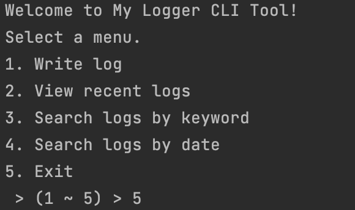
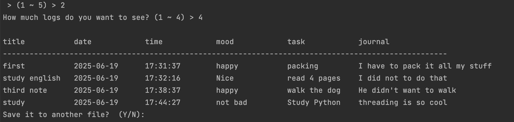

# 📦 my_logger - Simple CSV Logging Tool

This is a lightweight Python logger designed to record structured log entries (like time, mood, task, journal) into a CSV file.

## ✅ Features
- Log events with a timestamp
- Save logs to a CSV file
- Reuse your own utility functions
- Minimal CLI-ready structure

## 📂 Folder Structure

```text
my_logger/
├── __init__.py
├── logger_core.py
└── utils/
    └── reusable_functions.py
```

## 🚀 How to Use

1. **Install as editable package:**

   ```bash
   pip install -e .
   ```

2. **How to run it**

   ```bash
   python -m my_logger
   ```

3. **Your file will be saved as:**

   ```plaintext
   log.csv
   ```

## Test it
   ```markdown
   After running `python -m my_logger`, check that a `log.csv` file is created with your input entry. 
   ```

## 🧾 Example Log Entry

```csv
title,date,time,mood,task,journal
third note,2025-06-19,17:38:37,happy,walk the dog,He didn't want to walk
```

## 🌌 Screenshots
   
   